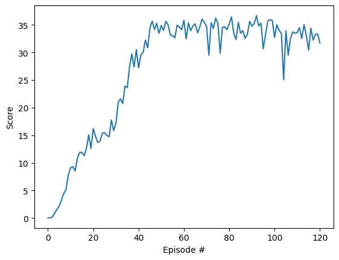

# Report

This report describes the Continous Control project for Udacity Deep Reinforcement Learning Nanodegree

## Learning algorithm

DDPG algorithm was used to solve this enviroment. Each state, action, reward, next state and info if episode is done is stored in replay buffer, from which they are sampled to be used in the learning process. In learning process critic takes in the state and action then compares the expected values of rewards calculated with weigths from local critic neural network with values calculated for next step and next action chosen by target actor network with weights from target critic network.

## Hyperparameters

* BUFFER_SZIE = int(1e5) - how many steps are stored in buffer
* BATCH_SIZE = 128 - how many steps are batched in training the NN
* n_episodes = 1000 - number of episodes after which learning stops
* max_t = 1000 - max steps in episode
* GAMMA = .99 - discount parameter
* TAU = 1e-3 - soft update parameter
* LR_ACTOR = 1e-4 - actor learning rate
* LR_CRITIC = 3e-4 - critic learning rate
* WEIGHT_DECAY = 0 - weight decay turned off
* SIGMA = 0.3 - OU Noise sigma parameter
* THETA = 0.15 - OU Noise theta parameter
* LEARN_EVERY = 20 - number of steps between learning
* LEARNS_NUM = 10 - number of times the networks are optimized each learning step

## Neural networks

In DDPG two neural networks architectures are used, one for the actor and one for the critic. Actor neural network consists of two fully connected layers with 600 and 400 neurons with relu activation function and an output layer with 4 neurons with hiperbolic tangens activation function. Critic neural network consists of two fully connected layers with 600 and 400 neurons with relu activation function and an output layer with one neuron.

## Score plot

The enviroment was solved in less then 100 episodes.

## Ideas for the future

In the future this project can be improved by applying different actor critic algorithms e.g. A3C or D4PG.